# System Architecture Diagrams
## Mermaid Code for Visualizations

This document contains Mermaid diagram code that can be rendered in GitHub, Notion, VS Code, or [mermaid.live](https://mermaid.live).

---

## 1. High-Level System Architecture

```mermaid
flowchart TB
    subgraph Households["🏠 Households (N Agents)"]
        H1["House 1<br/>demand: d₁"]
        H2["House 2<br/>demand: d₂"]
        H3["House 3<br/>demand: d₃"]
        Hn["House N<br/>demand: dₙ"]
    end

    subgraph Coordinator["⬡ Coordinator (Untrusted)"]
        AGG["Homomorphic<br/>Aggregation"]
        PUB["Public Key Only<br/>❌ Cannot Decrypt"]
    end

    subgraph Utility["⚡ Utility Company (Trusted)"]
        SK["🔑 Secret Key Holder"]
        DEC["Decrypt & Verify"]
        LB["Load Balance<br/>Decision"]
    end

    H1 -->|"E(d₁) + C₁"| AGG
    H2 -->|"E(d₂) + C₂"| AGG
    H3 -->|"E(d₃) + C₃"| AGG
    Hn -->|"E(dₙ) + Cₙ"| AGG

    AGG -->|"E(Σdᵢ) + C_agg"| DEC
    DEC --> LB
    LB -->|"Load Commands"| Households

    style Coordinator fill:#2d333b,stroke:#f0a500
    style Utility fill:#1a4d2e,stroke:#4ecca3
    style Households fill:#1a3a4d,stroke:#58a6ff
```

---

## 2. Data Flow Sequence Diagram

```mermaid
sequenceDiagram
    participant H as 🏠 Household
    participant C as ⬡ Coordinator
    participant U as ⚡ Utility

    Note over H: Has Public Key Only
    Note over C: Has Public Key Only
    Note over U: Has Secret Key

    H->>H: Generate demand d
    H->>H: Encrypt: E(d) using CKKS
    H->>H: Commit: C = g^d × h^r
    
    H->>C: Send E(d), C
    H-->>U: Send Opening (d, r) via secure channel

    C->>C: Aggregate: E(Σd) = ΣE(dᵢ)
    C->>C: Aggregate: C_agg = ∏Cᵢ
    
    C->>U: Send E(Σd), C_agg

    U->>U: Decrypt: sum = Dec(E(Σd))
    U->>U: Aggregate openings: Σrᵢ
    U->>U: Verify: C_agg == g^sum × h^Σr
    
    alt Verification Passes
        U->>U: Make load balance decision
        U->>H: Send commands
    else Verification Fails
        U->>U: ⚠️ Coordinator cheated!
    end
```

---

## 3. Cryptographic Layer

---

## 4. Security Model

```mermaid
flowchart TB
    subgraph Trust["Trust Levels"]
        direction LR
        T1["🟢 Trusted"]
        T2["🟡 Honest-but-Curious"]
        T3["🔴 Untrusted"]
    end

    subgraph Entities
        H["🏠 Household<br/>Sees: Own data only"]
        C["⬡ Coordinator<br/>Sees: Ciphertexts only"]
        U["⚡ Utility<br/>Sees: Aggregates only"]
        A["👤 Attacker<br/>Sees: Nothing useful"]
    end

    T1 -.-> U
    T2 -.-> C
    T3 -.-> A

    H -->|"E(d)"| C
    C -->|"E(Σd)"| U
    A -.->|"Intercepts E(d)"| C
    A -.->|"Cannot decrypt<br/>128-bit security"| A

    style T1 fill:#1a4d2e
    style T2 fill:#4d3d1a
    style T3 fill:#4d1a1a
```

---

## 5. Component Architecture

---

## 6. Encryption Pipeline

```mermaid
flowchart LR
    subgraph Agent["Agent Side"]
        P1["Plaintext<br/>3.45 kW"]
        E1["CKKS Encrypt"]
        C1["Pedersen Commit"]
    end

    subgraph Coordinator["Coordinator Side"]
        AGG["Σ E(dᵢ)"]
        CAGG["∏ Cᵢ"]
    end

    subgraph Utility["Utility Side"]
        DEC["Decrypt"]
        VER["Verify"]
        OUT["86.7 kW Total"]
    end

    P1 --> E1 --> AGG --> DEC --> OUT
    P1 --> C1 --> CAGG --> VER
    DEC --> VER

    style Agent fill:#1a3a4d
    style Coordinator fill:#2d333b
    style Utility fill:#1a4d2e
```

---

## 7. Load Balancing Decision Flow

---

## Usage

To render these diagrams:

1. **GitHub**: Paste directly in `.md` files - GitHub renders Mermaid natively
2. **VS Code**: Install "Markdown Preview Mermaid Support" extension
3. **Notion**: Use `/code` block with Mermaid language
4. **Online**: Go to [mermaid.live](https://mermaid.live) and paste the code
5. **Export**: Use mermaid CLI to export as PNG/SVG
