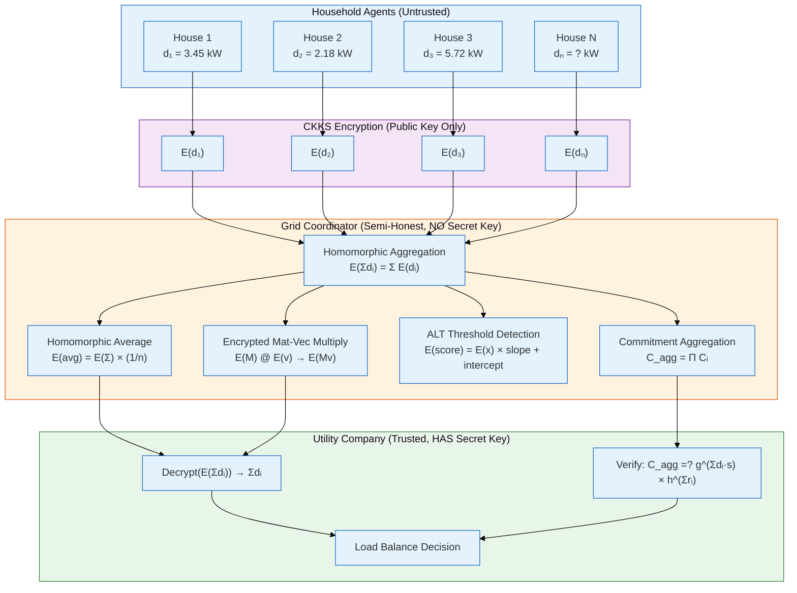
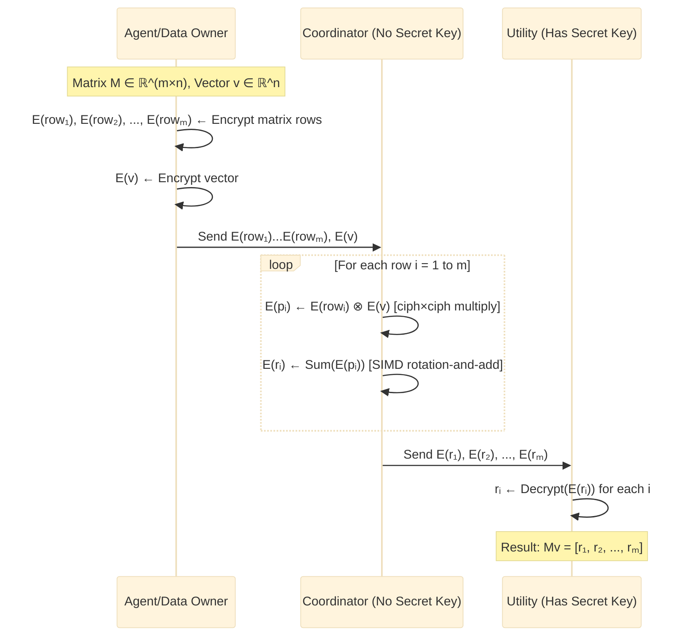
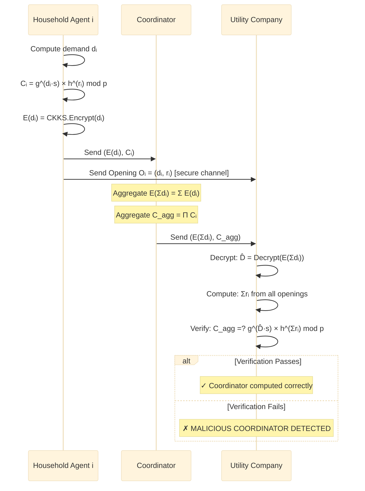

# Mermaid Diagram Codes for Research Paper Figures

Render these at https://mermaid.live or using mermaid-cli.

## Figure 1: System Architecture

## Supplementary: FHE Matrix-Vector Multiply Sequence

## Supplementary: Verifiable Aggregation Protocol

